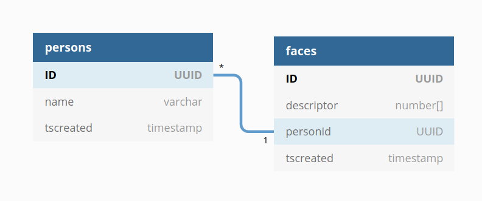

# Welcome! My name is Davor and this is my thesis about Face Recognition.

#### Let's see what can Deep Learning achieve!

<hr>

#### Tech stack


<hr>


#### Manual setup

```
sudo apt-get update
sudo apt-get -y install build-essential

conda create --name exp tensorflow-gpu python=3.7
conda init bash
conda activate exp
conda install -c conda-forge opencv=4.4.0
conda install -c anaconda psycopg2
conda install -c conda-forge pyfiglet
conda install -c conda-forge mtcnn
conda install -c anaconda pillow
conda install -c anaconda flask
conda install -c anaconda flask-cors
pip3 install Cython
pip3 install n2
pip3 install googledrivedownloader

git clone https://github.com/DavorJordacevic/DeepLearningFaceRecognitionSystem
cd DeepLearningFaceRecognitionSystem

wget https://raw.githubusercontent.com/opencv/opencv_extra/master/testdata/dnn/opencv_face_detector.pbtxt
wget https://github.com/spmallick/learnopencv/raw/master/AgeGender/opencv_face_detector_uint8.pb

git clone https://github.com/DavorJordacevic/ArcFace-TF2.x
mv ArcFace-TF2.x arcface_tf2

python downloadCheckpoints.py
rm -rf arc_mbv2.zip
mkdir arcface_tf2/checkpoints
mv arc_mbv2 arcface_tf2/checkpoints/arc_mbv2

git clone https://github.com/DavorJordacevic/retinaface-tf2
mv retinaface-tf2 retinaface_tf2
rm -rf retinaface_mbv2.zip
mkdir retinaface_tf2/checkpoints
mv retinaface_mbv2 retinaface_tf2/checkpoints/retinaface_mbv2
```


#### Automatic setup

```$ bash frapp.sh```

### Database model


### Frontend
Check: <a href="https://github.com/DavorJordacevic/FaceRecognition-FrontEnd">Frontend</a>

### Complete system setup (FRAPP, Database, <a href="https://github.com/DavorJordacevic/FaceRecognition-FrontEnd">Frontend</a>, <a href="https://github.com/DavorJordacevic/ArcFace-TF2.x">ArcFace</a>, <a href="https://github.com/DavorJordacevic/retinaface-tf2">RetinaFace</a>)
Check: <a href="https://github.com/DavorJordacevic/FRAPP_Setup">FRAPP Setup</a>

#### Face recognition process


<hr>

#### Start the service

```
$ ./start.sh
```

##### Stop the service

```
$ ./stop.sh
```

#### TODO
* Fix face anti-spoofing
* Docker
* Add multithreading
* Code refactor
* Swagger
* Speed up

<hr>

#### License

### References

<a href="https://github.com/peteryuX/arcface-tf2">peteryuX/arcface-tf2</a>

<a href="https://github.com/peteryuX/retinaface-tf2">peteryuX/retinaface-tf2</a>

<a href="https://github.com/kakao/n2">kakao/N2</a>

